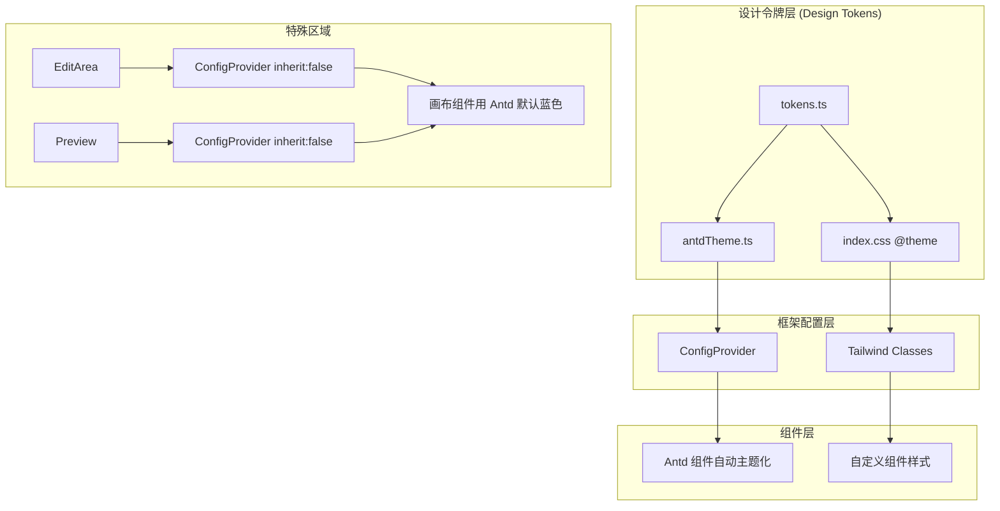

# UI 设计系统架构文档

本文档详细说明了低代码编辑器的 UI 分层架构，帮助理解和维护项目的视觉设计系统。

---

## 架构概览



---

## 1. 设计令牌层 (Design Tokens)

### 1.1 tokens.ts - 单一真值源

**路径**: `src/theme/tokens.ts`

设计令牌是整个 UI 系统的基础，定义了所有颜色、间距、圆角等基础值。

```typescript
// 色板结构 (50-900 分级)
export const neutral = { 50: "#fafaf9", ..., 900: "#1c1917" };
export const accent = { 50: "#f8fafc", ..., 900: "#0f172a" };  // slate blue
export const success/warning/danger = { ... };

// 语义化令牌 (基于用途命名)
export const semantic = {
  text: { primary, secondary, tertiary, inverse, accent },
  surface: { base, elevated, sunken },
  border: { default, subtle, strong, focus },
  accent: { default, hover, subtle },
  state: { success, warning, danger, ... },
};
```

**规则**:

- 颜色使用 50-900 分级（100 最浅，900 最深）
- 组件中应使用 `semantic` 语义令牌，而非直接引用 `neutral[500]`

### 1.2 antdTheme.ts - Antd 主题配置

**路径**: `src/theme/antdTheme.ts`

将 tokens 映射到 Antd 的 Design Token 系统：

```typescript
export const antdTheme: ThemeConfig = {
  token: {
    colorPrimary: semantic.accent.default, // 主色
    colorBgContainer: semantic.surface.elevated,
    colorText: semantic.text.primary,
    borderRadius: radius.md,
    // ...
  },
  components: {
    Button: { borderRadius: radius.md },
    Segmented: { trackBg: neutral[100] },
    // ...
  },
};
```

### 1.3 index.css @theme - Tailwind 4 主题

**路径**: `src/index.css`

使用 Tailwind 4 的 `@theme` 指令定义 CSS 变量：

```css
@theme {
  --color-neutral-50: #fafaf9;
  --color-accent-600: #475569;
  --color-surface: var(--color-neutral-50);
  --color-border: var(--color-neutral-200);
  /* ... */
}
```

**产出**: 自动生成 Tailwind 工具类如 `bg-neutral-500`、`text-accent-600`、`border-border`

---

## 2. 框架配置层

### 2.1 ConfigProvider (App.tsx)

**路径**: `src/App.tsx`

全局包裹，使所有 Antd 组件自动应用主题：

```tsx
<ConfigProvider theme={antdTheme}>
  <ReactPlayground />
</ConfigProvider>
```

### 2.2 嵌套 ConfigProvider (隔离区域)

画布和预览区需要使用 Antd 默认蓝色主题，通过嵌套 ConfigProvider 重置：

```tsx
// EditArea/index.tsx 和 Preview/index.tsx
<ConfigProvider theme={{ inherit: false }}>{componentTree}</ConfigProvider>
```

**效果**: 用户拖放的 Button 等组件显示 Antd 默认蓝色，而非编辑器的 slate blue

---

## 3. 组件层样式规范

### 3.1 Tailwind 类命名

使用语义化的 Tailwind 类：

| 用途 | 类名示例                                              |
| ---- | ----------------------------------------------------- |
| 背景 | `bg-surface`, `bg-surface-elevated`, `bg-neutral-100` |
| 文字 | `text-text-primary`, `text-neutral-500`               |
| 边框 | `border-border`, `border-neutral-200`                 |
| 圆角 | `rounded-lg`, `rounded-md`                            |

### 3.2 禁止事项

❌ **禁止在组件中使用 `!className`**

```tsx
// 错误 ❌
className = "!bg-gray-50 !border-red-300";

// 正确 ✅
className = "bg-neutral-100 border-danger-300";
```

❌ **禁止硬编码颜色**

```tsx
// 错误 ❌
className = "bg-[#f5f5f4]";

// 正确 ✅
className = "bg-neutral-100";
```

### 3.3 Antd 组件样式

Antd 组件通过 ConfigProvider 自动主题化，无需手动添加样式类：

```tsx
// 正确 ✅ - 让 ConfigProvider 处理
<Button type="primary">按钮</Button>
<Segmented options={[...]} />

// 错误 ❌ - 手动覆盖 Antd 样式
<Button className="!bg-blue-500">按钮</Button>
```

---

## 4. 文件结构

```
src/
├── theme/
│   ├── tokens.ts          # 设计令牌定义
│   └── antdTheme.ts       # Antd ConfigProvider 配置
├── index.css              # Tailwind @theme + 全局样式
├── App.tsx                # ConfigProvider 入口
└── editor/
    └── components/
        ├── Header/        # 编辑器头部（使用编辑器主题）
        ├── EditArea/      # 画布区（嵌套 ConfigProvider 重置为默认）
        ├── Preview/       # 预览区（嵌套 ConfigProvider 重置为默认）
        ├── Setting/       # 设置面板
        └── MaterialWrapper/ # 物料面板
```

---

## 5. 颜色对照表

### 5.1 Neutral 色板 (石灰色)

| 级别 | 色值      | 用途             |
| ---- | --------- | ---------------- |
| 50   | `#fafaf9` | 页面背景         |
| 100  | `#f5f5f4` | 卡片背景、分割线 |
| 200  | `#e7e5e4` | 边框默认         |
| 300  | `#d6d3d1` | 边框强调         |
| 400  | `#a8a29e` | 三级文字         |
| 500  | `#78716c` | 二级文字         |
| 600  | `#57534e` | -                |
| 700  | `#44403c` | -                |
| 800  | `#292524` | -                |
| 900  | `#1c1917` | 一级文字         |

### 5.2 Accent 色板 (石板蓝)

| 级别 | 色值      | 用途               |
| ---- | --------- | ------------------ |
| 600  | `#475569` | 主按钮背景、强调色 |
| 700  | `#334155` | 主按钮 hover       |

---

## 6. 修改指南

### 6.1 修改主色调

1. 编辑 `tokens.ts` 中的 `accent` 对象
2. 同步修改 `index.css` 的 `@theme { --color-accent-* }` 变量
3. 颜色需保持 50-900 的渐变一致性

### 6.2 添加新的语义令牌

1. 在 `tokens.ts` 的 `semantic` 对象中添加
2. 在 `antdTheme.ts` 的 `token` 中添加对应 Antd 映射
3. 在 `index.css` 的 `@theme` 中添加 CSS 变量

### 6.3 自定义 Antd 组件

在 `antdTheme.ts` 的 `components` 中配置：

```typescript
components: {
  Button: { borderRadius: 8, primaryShadow: "none" },
  Input: { activeShadow: "0 0 0 2px #e2e8f0" },
}
```

---

## 7. 技术债务提醒

> ⚠️ `tokens.ts` 与 `index.css @theme` 需手动同步

由于 Tailwind 4 采用 CSS-first 配置，而 Antd 需要 JS 对象，两份配置需人工保持一致。修改颜色时务必同时更新两个文件。

未来可考虑编写构建脚本自动从 `tokens.ts` 生成 CSS 变量。
