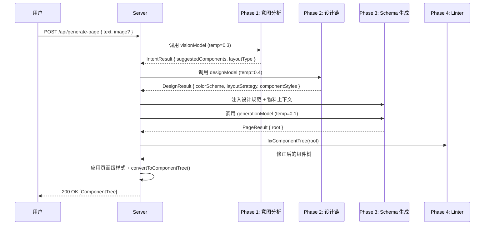

# 1. 系统概述

## 1.1 功能定位

AI 页面生成系统是低代码编辑器的核心能力之一，允许用户通过 **自然语言描述** 或 **上传设计稿截图** 自动生成可编辑的页面 Schema。

### 核心能力

| 能力      | 描述                                             |
| --------- | ------------------------------------------------ |
| 文本生成  | 根据用户描述（如"生成一个登录页面"）生成完整页面 |
| 图像理解  | 解析设计稿截图，提取布局和组件信息               |
| 智能补全  | 主动扩展简单需求为生产级页面设计                 |
| 🎨 设计链 | **新增!** 自动生成配色、布局、间距等视觉设计方案 |
| 语义修正  | 自动修复 AI 生成中的结构错误                     |

## 1.2 技术栈

| 技术             | 版本/说明         | 用途                    |
| ---------------- | ----------------- | ----------------------- |
| Express.js       | v4.x              | HTTP 服务器             |
| LangChain        | @langchain/openai | LLM 调用封装            |
| JsonOutputParser | @langchain/core   | JSON 输出解析           |
| OpenAI API       | gpt-4o-mini       | 多模态模型（文本+图像） |
| TypeScript       | v5.x              | 类型安全                |

## 1.3 设计原则

### 1.3.1 四阶段流水线 (v4)

```
┌─────────────────────────────────────────────────────┐
│              Phase 1: 意图分析                       │
│      "理解需求，预测所需组件，确定页面类型"           │
└─────────────────────────────────────────────────────┘
                         ↓
┌─────────────────────────────────────────────────────┐
│          Phase 2: 设计链 (Design Chain) 🆕          │
│   "确定布局策略、配色方案、排版规范、组件样式"        │
└─────────────────────────────────────────────────────┘
                         ↓
┌─────────────────────────────────────────────────────┐
│              Phase 3: Schema 生成                    │
│         "基于设计规范生成带样式的组件树"             │
└─────────────────────────────────────────────────────┘
                         ↓
┌─────────────────────────────────────────────────────┐
│              Phase 4: Linter 修正                    │
│         "语义修正：父子约束修复、属性上浮"            │
└─────────────────────────────────────────────────────┘
```

### 1.3.2 Core + Recall 策略

为避免 Token 爆炸，采用动态物料筛选：

- **Core 组件**：永远加载的万金油组件（Page, Container, Grid, Typography, Button 等）
- **Recall 组件**：根据意图分析阶段预测的 `suggestedComponents` 动态加载

```typescript
const CORE_COMPONENTS = new Set([
  "Page",
  "Container",
  "Grid",
  "GridColumn",
  "Typography",
  "Button",
  "Icon",
  "Space",
]);
```

## 1.4 核心流程摘要



## 1.5 v4 新特性：Design Chain

Design Chain 是 v4 版本的核心创新，通过独立的设计阶段解决以下问题：

| 问题       | v3 方案               | v4 方案                  |
| ---------- | --------------------- | ------------------------ |
| 样式单调   | AI 直接生成，样式简陋 | 设计链预先规划配色、间距 |
| 风格不一致 | 每次生成风格随机      | 统一的设计规范指导       |
| 布局不专业 | 仅依赖 Prompt 引导    | 专门的布局策略决策       |
