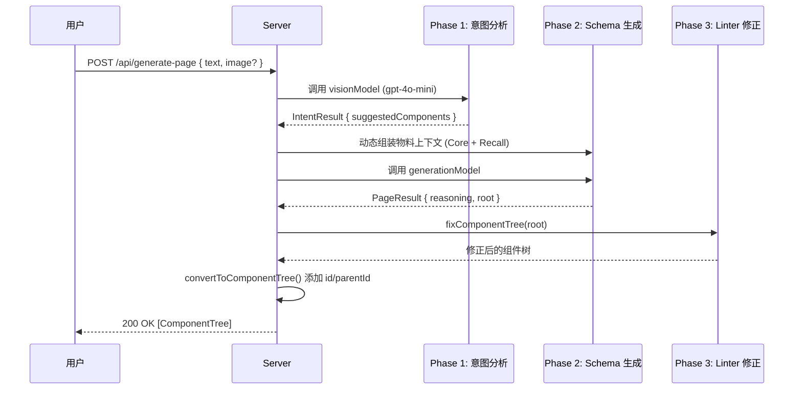

# 1. 系统概述

## 1.1 功能定位

AI 页面生成系统是低代码编辑器的核心能力之一，允许用户通过 **自然语言描述** 或 **上传设计稿截图** 自动生成可编辑的页面 Schema。

### 核心能力

| 能力     | 描述                                             |
| -------- | ------------------------------------------------ |
| 文本生成 | 根据用户描述（如"生成一个登录页面"）生成完整页面 |
| 图像理解 | 解析设计稿截图，提取布局和组件信息               |
| 智能补全 | 主动扩展简单需求为生产级页面设计                 |
| 语义修正 | 自动修复 AI 生成中的结构错误                     |

## 1.2 技术栈

| 技术       | 版本/说明         | 用途                            |
| ---------- | ----------------- | ------------------------------- |
| Express.js | v4.x              | HTTP 服务器                     |
| LangChain  | @langchain/openai | LLM 调用封装                    |
| Zod        | v4.x              | Schema 定义与 Structured Output |
| OpenAI API | gpt-4o-mini       | 多模态模型（文本+图像）         |
| TypeScript | v5.x              | 类型安全                        |

## 1.3 设计原则

### 1.3.1 分层职责

```
┌─────────────────────────────────────────────────────┐
│                    Prompt 工程                       │
│    "引导 LLM 生成结构正确、语义合理的 Schema"         │
└─────────────────────────────────────────────────────┘
                         ↓
┌─────────────────────────────────────────────────────┐
│                  Zod Structured Output              │
│         "语法校验：JSON 结构正确、组件名合法"         │
└─────────────────────────────────────────────────────┘
                         ↓
┌─────────────────────────────────────────────────────┐
│                    Linter 后处理                     │
│         "语义修正：父子约束修复、属性上浮"            │
└─────────────────────────────────────────────────────┘
```

### 1.3.2 Core + Recall 策略

为避免 Token 爆炸，采用动态物料筛选：

- **Core 组件**：永远加载的万金油组件（Page, Container, Grid, Typography, Button 等）
- **Recall 组件**：根据意图分析阶段预测的 `suggestedComponents` 动态加载

```typescript
const CORE_COMPONENTS = new Set([
  "Page",
  "Container",
  "Grid",
  "GridColumn",
  "Typography",
  "Button",
  "Icon",
  "Space",
]);
```

## 1.4 核心流程摘要


