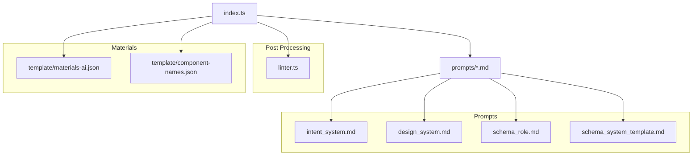
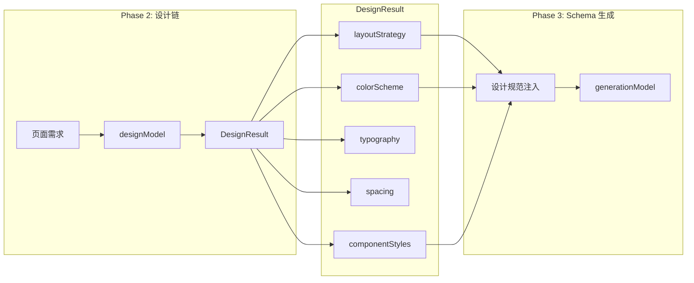

# 2. 架构设计

## 2.1 四阶段管道架构 (v4)

AI 页面生成采用 **四阶段管道** 设计，每个阶段职责明确：

```
┌──────────────────┐    ┌──────────────────┐    ┌──────────────────┐    ┌──────────────────┐
│   Phase 1        │    │   Phase 2        │    │   Phase 3        │    │   Phase 4        │
│   意图分析       │ -> │   设计链 🆕      │ -> │   Schema 生成    │ -> │   Linter 修正    │
│   (Intent)       │    │   (Design)       │    │   (Generation)   │    │   (Post-process) │
└──────────────────┘    └──────────────────┘    └──────────────────┘    └──────────────────┘
     ↓                       ↓                       ↓                       ↓
  IntentResult          DesignResult             PageResult              FinalSchema
  - description         - layoutStrategy         - root (组件树)         - 添加 id/parentId
  - layoutType          - colorScheme                                    - 修复父子约束
  - suggestedComponents - componentStyles                                - 应用页面样式
```

## 2.2 模块职责

### 2.2.1 `server/index.ts` - 主入口

| 职责       | 描述                                                 |
| ---------- | ---------------------------------------------------- |
| HTTP 服务  | Express 路由，CORS，JSON 解析                        |
| 模型初始化 | 配置 `visionModel`、`designModel`、`generationModel` |
| 物料筛选   | `getMaterialContext()` 实现 Core + Recall            |
| 四阶段管道 | `generatePage()` 编排完整流程                        |
| 错误处理   | 统一异常捕获，返回友好错误信息                       |

**关键代码片段**：

```typescript
// 三个模型，不同温度参数
const visionModel = new ChatOpenAI({
  model: "gpt-4o-mini",
  temperature: 0.3, // 适中温度，理解用户意图
});

const designModel = new ChatOpenAI({
  model: "gpt-4o-mini",
  temperature: 0.4, // 稍高温度，允许更多创意
});

const generationModel = new ChatOpenAI({
  model: "gpt-4o-mini",
  temperature: 0.1, // 极低温度，保证 Schema 稳定性
});
```

### 2.2.2 `server/linter.ts` - 语义修正器

| 函数                       | 职责                                    |
| -------------------------- | --------------------------------------- |
| `fixComponentTree()`       | 递归遍历，修复父子约束违规              |
| `convertToComponentTree()` | 添加 `id` 和 `parentId`，转换为前端格式 |

**核心规则表**：

```typescript
const PARENT_CHILD_RULES: Record<string, FixRule> = {
  Form: {
    expectedChild: "FormItem",
    wrapperPropsLift: ["label", "name", "rules"],
  },
  Grid: { expectedChild: "GridColumn", wrapperPropsLift: ["span", "offset"] },
  Table: {
    expectedChild: "TableColumn",
    wrapperPropsLift: ["title", "dataIndex"],
  },
  List: { expectedChild: "ListItem" },
  Tabs: { expectedChild: "TabPane", wrapperPropsLift: ["tab", "label"] },
};
```

## 2.3 模块依赖关系



## 2.4 LLM 调用策略

| 阶段                 | 模型        | Temperature | 说明                       |
| -------------------- | ----------- | ----------- | -------------------------- |
| Phase 1: 意图分析    | gpt-4o-mini | 0.3         | 需要一定创造性理解用户意图 |
| Phase 2: 设计链      | gpt-4o-mini | 0.4         | 更高创意度，设计配色和布局 |
| Phase 3: Schema 生成 | gpt-4o-mini | 0.1         | 严格遵循结构，减少幻觉     |

**JsonOutputParser 使用**：

```typescript
// 使用 JsonOutputParser 替代 Structured Output（更兼容）
const jsonParser = new JsonOutputParser();

const intentResponse = await visionModel.invoke(messages);
const intent = await jsonParser.invoke(intentResponse.content as string);
```

## 2.5 设计链数据流



## 2.6 页面级样式应用

在 Phase 4 (Linter) 阶段，会将设计链的页面级样式应用到根节点：

```typescript
// 应用页面级别样式
if (design.layoutStrategy?.pageBackground) {
  rootNode.styles.backgroundColor = design.layoutStrategy.pageBackground;
  rootNode.styles.minHeight = "100vh";
}
```
