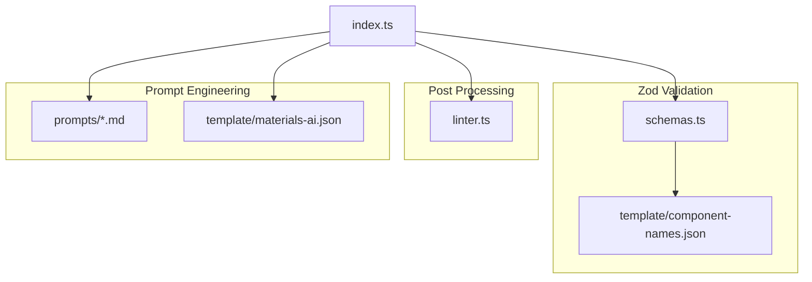

# 2. 架构设计

## 2.1 三阶段管道架构

AI 页面生成采用 **三阶段管道** 设计，每个阶段职责明确：

```
┌──────────────────┐    ┌──────────────────┐    ┌──────────────────┐
│   Phase 1        │    │   Phase 2        │    │   Phase 3        │
│   意图分析       │ -> │   Schema 生成    │ -> │   Linter 修正    │
│   (Intent)       │    │   (Generation)   │    │   (Post-process) │
└──────────────────┘    └──────────────────┘    └──────────────────┘
     ↓                       ↓                       ↓
  IntentResult          PageResult              FinalSchema
  - description         - reasoning             - 添加 id/parentId
  - layoutType          - root (组件树)         - 修复父子约束
  - suggestedComponents                         - 属性上浮
```

## 2.2 模块职责

### 2.2.1 `server/index.ts` - 主入口

| 职责       | 描述                                      |
| ---------- | ----------------------------------------- |
| HTTP 服务  | Express 路由，CORS，JSON 解析             |
| 模型初始化 | 配置 `visionModel` 和 `generationModel`   |
| 物料筛选   | `getMaterialContext()` 实现 Core + Recall |
| 生成管道   | `generatePage()` 编排三阶段流程           |
| 错误处理   | 统一异常捕获，返回友好错误信息            |

**关键代码片段**：

```typescript
// 模型配置
const visionModel = new ChatOpenAI({
  model: "gpt-4o-mini",
  temperature: 0.3, // 较低温度保证一致性
  configuration: { baseURL: baseUrl, timeout: 60000 },
});

const generationModel = new ChatOpenAI({
  model: "gpt-4o-mini",
  temperature: 0.1, // 极低温度保证 Schema 稳定性
});
```

### 2.2.2 `server/schemas.ts` - Zod Schema

| Schema              | 用途                                                             |
| ------------------- | ---------------------------------------------------------------- |
| `ComponentNameEnum` | 从 `component-names.json` 动态生成的合法组件名枚举               |
| `ComponentSchema`   | 递归组件结构定义（name, props, styles, children）                |
| `IntentSchema`      | Phase 1 输出结构（description, layoutType, suggestedComponents） |
| `PageSchema`        | Phase 2 输出结构（reasoning, root）                              |

**设计决策**：

```typescript
// 为什么 props 使用 z.any() 而不是 z.record()？
// OpenAI Structured Output 不支持 z.record()，会生成 propertyNames
const BaseComponentSchema = z.object({
  name: ComponentNameEnum,
  props: z.any(), // 宽松校验，细节交给 Linter
  styles: z.any(),
});
```

### 2.2.3 `server/linter.ts` - 语义修正器

| 函数                       | 职责                                    |
| -------------------------- | --------------------------------------- |
| `fixComponentTree()`       | 递归遍历，修复父子约束违规              |
| `convertToComponentTree()` | 添加 `id` 和 `parentId`，转换为前端格式 |

**核心规则表**：

```typescript
const PARENT_CHILD_RULES: Record<string, FixRule> = {
  Form: {
    expectedChild: "FormItem",
    wrapperPropsLift: ["label", "name", "rules"],
  },
  Grid: { expectedChild: "GridColumn", wrapperPropsLift: ["span", "offset"] },
  Table: {
    expectedChild: "TableColumn",
    wrapperPropsLift: ["title", "dataIndex"],
  },
  List: { expectedChild: "ListItem" },
  Tabs: { expectedChild: "TabPane", wrapperPropsLift: ["tab", "label"] },
};
```

## 2.3 模块依赖关系



## 2.4 LLM 调用策略

| 阶段    | 模型        | Temperature | 说明                           |
| ------- | ----------- | ----------- | ------------------------------ |
| Phase 1 | gpt-4o-mini | 0.3         | 需要一定创造性理解用户意图     |
| Phase 2 | gpt-4o-mini | 0.1         | 严格遵循 Schema 结构，减少幻觉 |

**Structured Output 使用**：

```typescript
// 强制 LLM 输出符合 Zod Schema 的 JSON
const intentModel = visionModel.withStructuredOutput(IntentSchema);
const intent = await intentModel.invoke(messages);
// intent 已经是强类型的 IntentResult
```
